# ruflu
원하는 상대와 매칭되면 대화할 수 있는 데이팅 앱

### 개발환경
- TargetSdkVersion : 31
- minSdkVersion : 21
- Android Studio Amulator, 갤럭시 Device
### 기술 스택
Language : Kotlin

Jetpack : ViewBinding, LiveData, Lifecycle, ViewModel, Navigation, Room

DI : Dagger-Hlit

Network : Retrofit2, OkHttp3

Asynchronous : Coroutine, Flow

Architecture : MVVM + Clean Architecture

# 화면
### Splash 화면
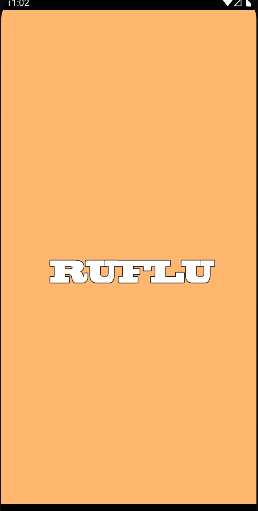

### Kakao Login 화면

  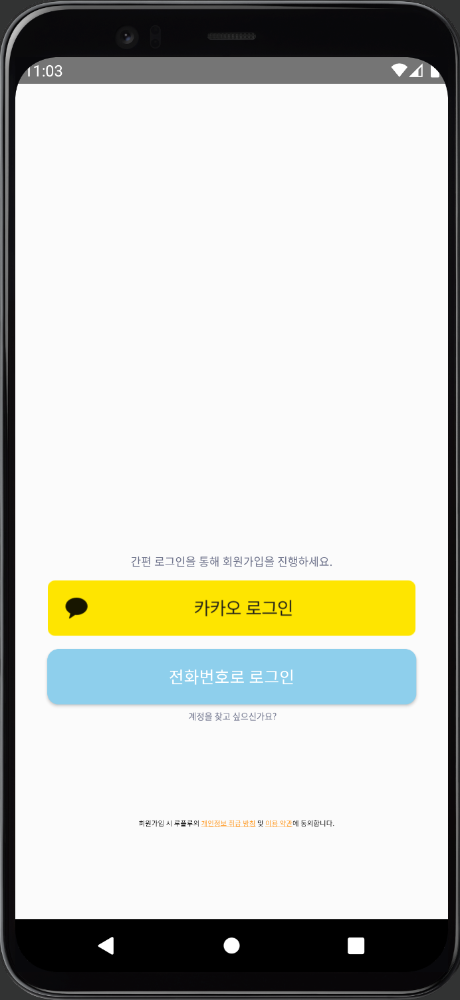
  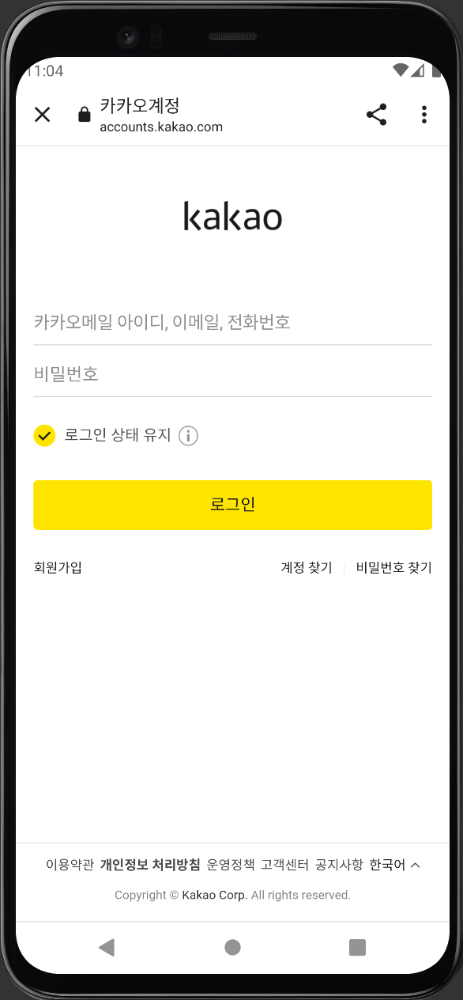

### 전화번호 Login 화면

  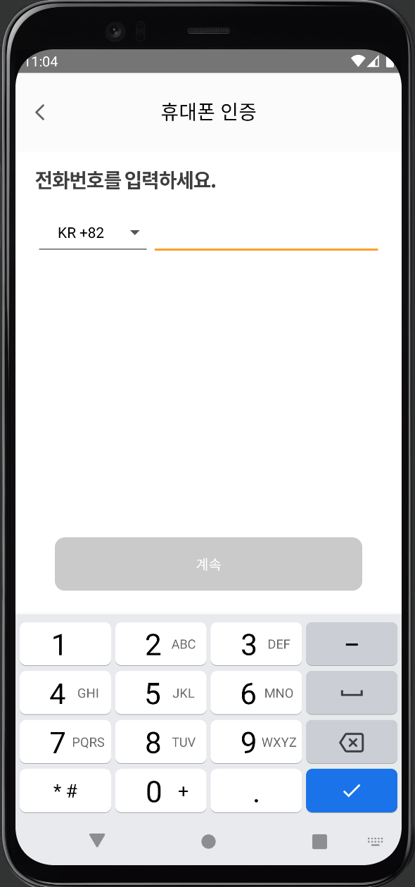
  
  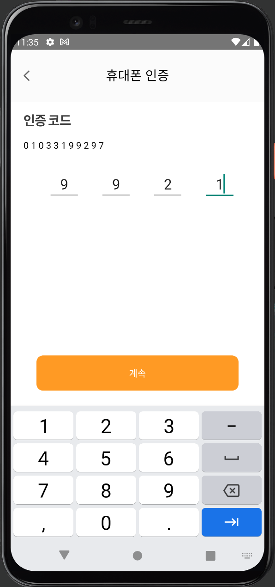

### 이메일 등록 화면

  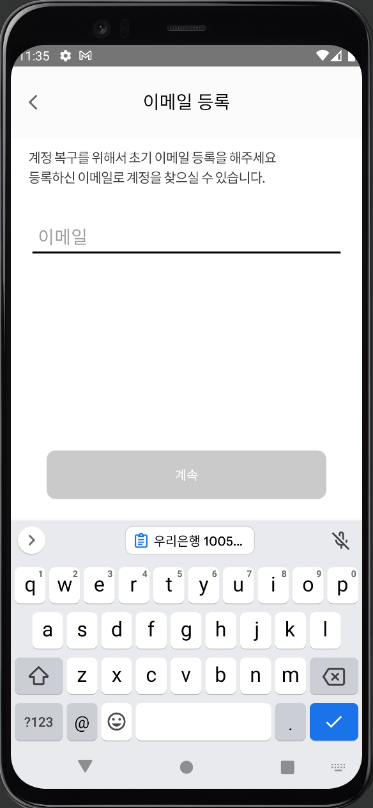
  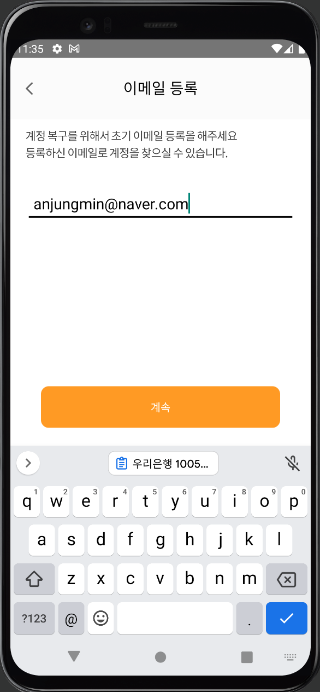

### Onboarding 화면

  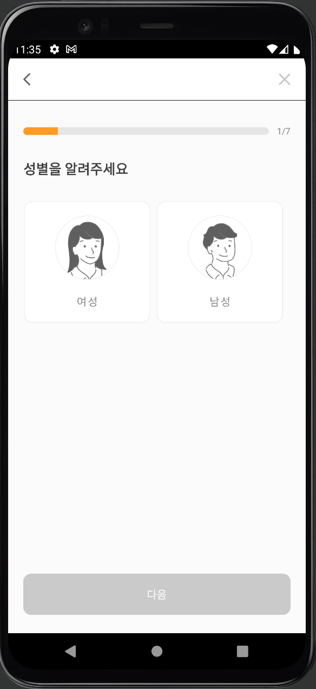
  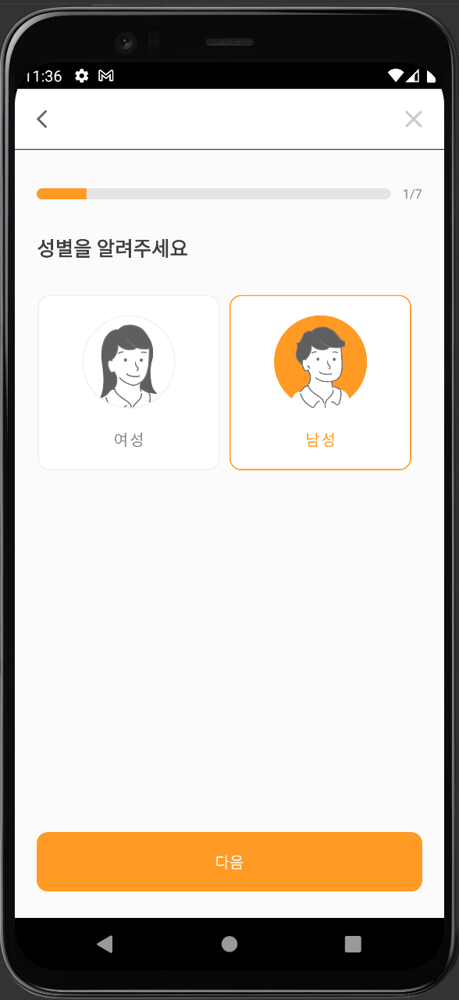
  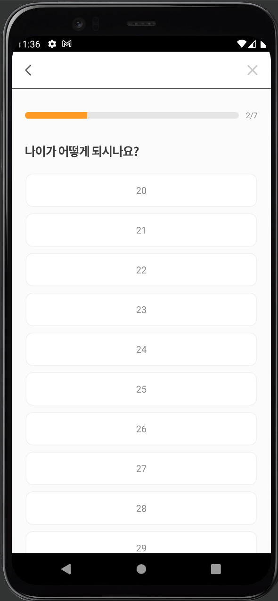
  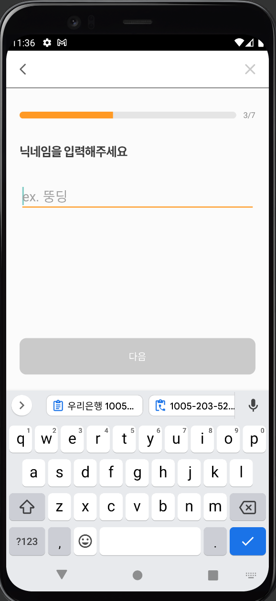
  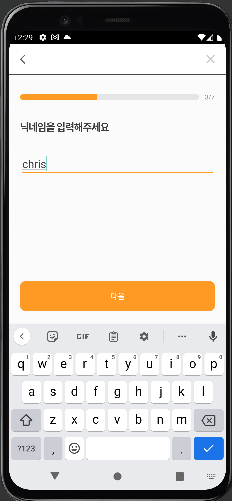
  
  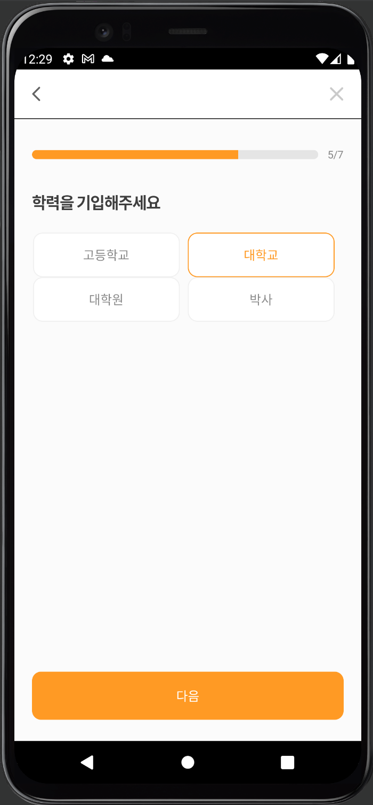
  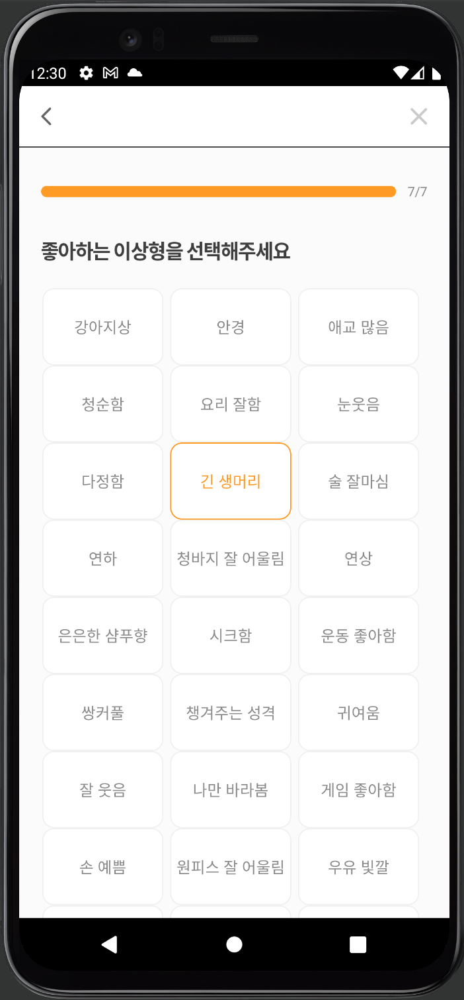

### Home 화면(image 캡쳐중)
### Like 화면(image 캡쳐중)
### Match 화면(image 캡쳐중)

### Chat (~ing)
### MyPage(~ing)
